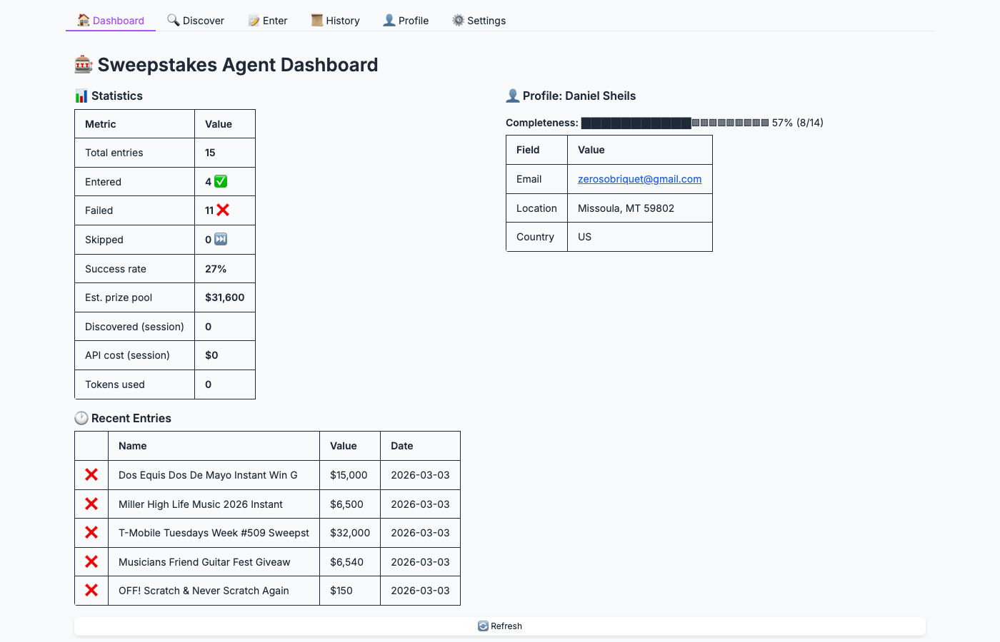
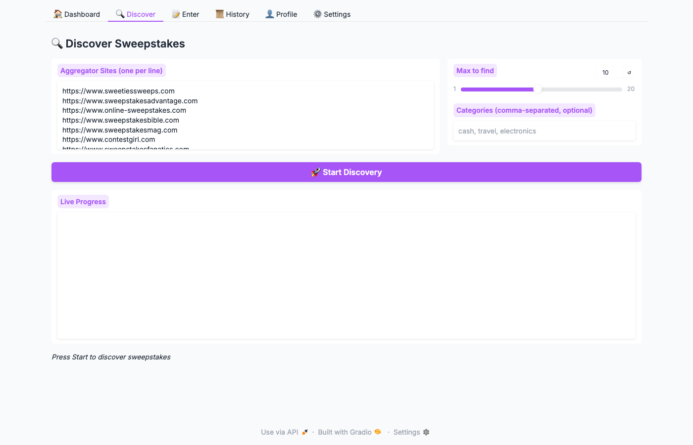
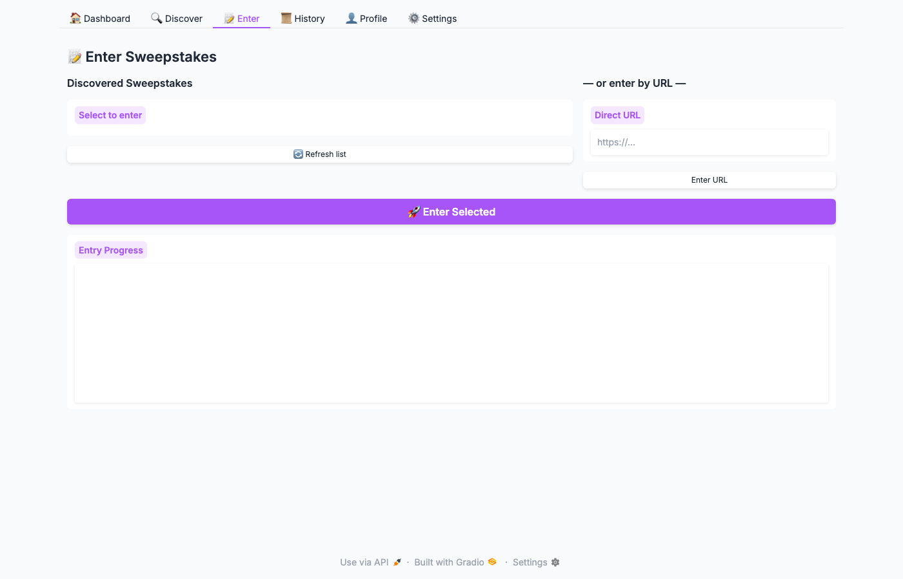
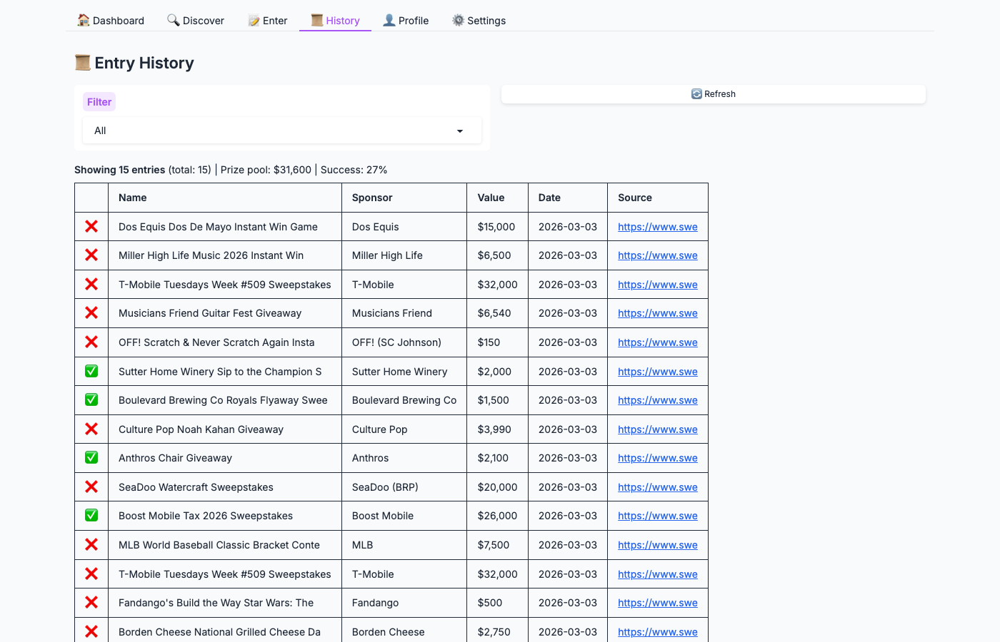
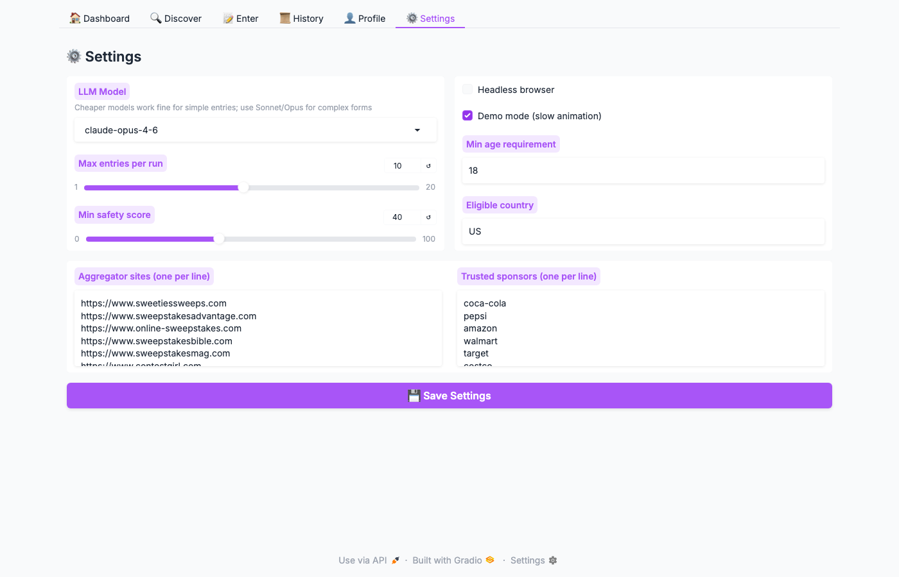

# Sweepstakes Agent

An AI-powered agent that automatically discovers and enters free, legitimate sweepstakes and contests on your behalf, built on [browser-use](https://github.com/browser-use/browser-use).

<p align="center">
  
  
  
</p>

## Screenshots

<p align="center">
  
</p>
<p align="center"><em>Dashboard — stats overview with cost tracking</em></p>

<p align="center">
  
</p>
<p align="center"><em>Discover — parallel aggregator scanning</em></p>

<p align="center">
  
</p>
<p align="center"><em>Enter — auto-fill and submit sweepstakes forms</em></p>

<p align="center">
  
</p>
<p align="center"><em>History — track all entries and results</em></p>

<p align="center">
  
</p>
<p align="center"><em>Settings — model selection, browser config, aggregator sites</em></p>

## Features

- **Parallel Discovery** — Scans 8 aggregator sites concurrently with `asyncio.gather` and a configurable semaphore (3 at a time), dramatically faster than sequential scanning
- **Tiered Model Strategy** — Discovery and URL extraction always use the cheapest model (Haiku); your chosen model is only used for actual form entry, cutting costs 3–5×
- **Browser Session Reuse** — A single `BrowserSession` is shared across all entries in a run, eliminating per-entry Chromium launch overhead
- **URL Resolution** — Aggregator blog-post URLs are automatically resolved to the real sweepstakes entry page before attempting entry
- **Cost & Token Tracking** — Real-time per-run cost and token counters displayed in the dashboard and CLI summary
- **Pre-flight URL Check** — Lightweight HTTP probe verifies that each URL is alive, returns HTML, and has form elements before spending LLM tokens on it
- **Multi-Layer Scam Detection** — Domain reputation, payment language detection, urgency scam patterns, and legitimacy signals
- **Auto-Entry** — Fills out and submits entry forms using your profile info with `sensitive_data` masking (the AI never sees your real data)
- **Safety First** — Never enters financial info, never pays, never downloads anything
- **Smart Field Detection** — Automatically skips sweepstakes requiring info you haven't provided (phone, DOB, address)
- **Entry Tracking** — JSON log prevents duplicates and tracks success rates
- **Web Dashboard** — Gradio UI with discovery, entry, history, profile, and settings tabs
- **CLI** — Full command-line interface for scripting and automation

## How It Works

### Phase 1: Discovery

The agent visits trusted sweepstakes aggregator sites **in parallel** (3 at a time by default) using the cheapest model (Haiku) and finds currently-open sweepstakes that:

- Are **free to enter** (no purchase necessary)
- Have **online entry forms** (not mail-only)
- Are **currently active** (not expired)
- Match your **eligibility** (country, age)
- Don't require fields you haven't provided

After discovery, each URL goes through:

1. **URL Resolution** — If the URL points to an aggregator blog post, the agent visits it with Haiku and extracts the real entry URL
2. **Pre-flight Check** — A lightweight HTTP probe confirms the URL is alive, returns HTML, and contains form elements before spending LLM tokens on it

### Phase 2: Entry

All entries share a single browser session for efficiency. For each validated sweepstakes, the agent:

1. Runs a pre-flight HTTP check (skips dead links/non-HTML pages)
2. Navigates to the entry page (using the shared browser session)
3. Runs a safety check (payment language, scam patterns)
4. Identifies form fields and checks which are required
5. Fills the form using placeholder keys (real values injected via `sensitive_data`)
6. Checks required checkboxes (rules agreement) and unchecks marketing opt-ins
7. Submits the entry
8. Verifies confirmation
9. Logs the result and records API cost/tokens

### Privacy & Security

Your personal information is protected through browser-use's `sensitive_data` feature:

- The AI agent only sees placeholder keys like `x_email`, `x_first_name`
- Your real values are injected at the browser level during form filling
- Your data is stored locally in `.env` and never sent to the AI
- The `.env` file is gitignored and never committed

## Quick Start

### Prerequisites

- Python 3.11+
- An [Anthropic API key](https://console.anthropic.com/)
- Chrome/Chromium browser

### 1. Clone and install

```bash
git clone https://github.com/RhythrosaLabs/sweepstakes-agent.git
cd sweepstakes-agent

# Install browser-use first
pip install browser-use

# Install this package
pip install -e .

# Install browser
playwright install chromium
```

### 2. Configure your profile

```bash
cp .env.example sweepstakes/.env
```

Edit `sweepstakes/.env` with your information:

```env
ANTHROPIC_API_KEY=sk-ant-...

# Required
SWEEPS_FIRST_NAME=Jane
SWEEPS_LAST_NAME=Doe
SWEEPS_EMAIL=jane@example.com

# Recommended (improves success rate)
SWEEPS_AGE=30
SWEEPS_CITY=Anytown
SWEEPS_STATE=CA
SWEEPS_ZIP=90210
SWEEPS_COUNTRY=US

# Optional — leave blank to auto-skip sweepstakes requiring these
# SWEEPS_PHONE=555-555-5555
# SWEEPS_DOB=01/15/1990
# SWEEPS_ADDRESS=123 Main St
```

> **Tip:** Only fill in what you're comfortable sharing. The agent will automatically skip sweepstakes that require fields you leave blank.

### 3. Run the agent

#### Web Dashboard (recommended)

```bash
python -m sweepstakes ui
```

Opens a Gradio dashboard at `http://localhost:7860` with tabs for:
- **Dashboard** — Stats and recent entries at a glance
- **Discover** — Scan aggregator sites with one click
- **Enter** — Auto-enter discovered sweepstakes or submit to a specific URL
- **History** — View all past entries with status filters
- **Profile** — Edit your info directly in the browser (saved to `.env`)
- **Settings** — Configure LLM model, browser settings, aggregator sites

#### Command Line

```bash
# Full pipeline: discover and enter
python -m sweepstakes

# Discovery only (find without entering)
python -m sweepstakes --discover-only

# Enter a specific URL directly
python -m sweepstakes --enter-url "https://example.com/sweepstakes"

# Limit to 5 entries, filter by category
python -m sweepstakes --max-entries 5 --categories "cash,gift cards"

# Run headless (no visible browser)
python -m sweepstakes --headless
```

## CLI Options

| Flag | Description |
|------|-------------|
| `ui` | Launch the Gradio web dashboard |
| `--max-entries N` | Maximum sweepstakes to enter per run |
| `--categories "a,b"` | Comma-separated category filter |
| `--headless` | Run without visible browser window |
| `--no-demo` | Disable demo mode (faster, no visual indicators) |
| `--model MODEL` | Claude model to use (default: `claude-sonnet-4-6`) |
| `--log-path PATH` | Path to JSON entry log file |
| `--discover-only` | Only discover, don't submit entries |
| `--enter-url URL` | Skip discovery, enter one specific sweepstakes |

## Environment Variables

| Variable | Required | Description |
|----------|----------|-------------|
| `ANTHROPIC_API_KEY` | **Yes** | Your Anthropic API key |
| `SWEEPS_FIRST_NAME` | **Yes** | First name |
| `SWEEPS_LAST_NAME` | **Yes** | Last name |
| `SWEEPS_EMAIL` | **Yes** | Email address |
| `SWEEPS_AGE` | Recommended | Your age |
| `SWEEPS_CITY` | Recommended | City |
| `SWEEPS_STATE` | Recommended | State/province |
| `SWEEPS_ZIP` | Recommended | ZIP/postal code |
| `SWEEPS_COUNTRY` | Optional | Country code (default: `US`) |
| `SWEEPS_PHONE` | Optional | Phone number (leave blank to skip sweepstakes requiring it) |
| `SWEEPS_DOB` | Optional | Date of birth `MM/DD/YYYY` (leave blank to skip) |
| `SWEEPS_ADDRESS` | Optional | Street address (leave blank to skip) |
| `SWEEPS_MAX_ENTRIES` | Optional | Max entries per run (default: `10`) |
| `SWEEPS_LLM_MODEL` | Optional | Claude model (default: `claude-sonnet-4-6`) |
| `SWEEPS_DEMO_MODE` | Optional | Show visual browser indicators (default: `true`) |
| `SWEEPS_HEADLESS` | Optional | Headless mode (default: `false`) |
| `SWEEPS_LOG_PATH` | Optional | Entry log path (default: `sweepstakes_entries.json`) |

## Aggregator Sites

The agent searches these reputable sweepstakes listing sites:

| Site | URL |
|------|-----|
| Sweeties Sweeps | [sweetiessweeps.com](https://www.sweetiessweeps.com) |
| Sweepstakes Advantage | [sweepstakesadvantage.com](https://www.sweepstakesadvantage.com) |
| Online Sweepstakes | [online-sweepstakes.com](https://www.online-sweepstakes.com) |
| Sweepstakes Bible | [sweepstakesbible.com](https://www.sweepstakesbible.com) |
| Sweepstakes Mag | [sweepstakesmag.com](https://www.sweepstakesmag.com) |
| Contest Girl | [contestgirl.com](https://www.contestgirl.com) |
| Sweepstakes Fanatics | [sweepstakesfanatics.com](https://www.sweepstakesfanatics.com) |
| I Love Giveaways | [ilovegiveaways.com](https://www.ilovegiveaways.com) |

You can add or remove sites in the Settings tab or by editing the config.

## Safety & Scam Protection

### Multi-Layer Validation

| Layer | What it checks |
|-------|----------------|
| **Domain reputation** | Known scam domains, suspicious TLDs (`.xyz`, `.click`, etc.) |
| **Trusted platforms** | Gleam.io, Rafflecopter, Woobox, and other legitimate entry widgets |
| **Brand verification** | Matches sponsors against known brands (Nike, Amazon, etc.) |
| **Payment detection** | Regex patterns for credit card fields, fees, subscriptions |
| **Info harvesting** | Flags requests for SSN, bank accounts, or excessive personal data |
| **Scam language** | "You've already won", "claim your prize", urgency tactics |
| **Legitimacy signals** | "No Purchase Necessary", Official Rules, AMOE, ARV |

### What the Agent Will NEVER Do

- ❌ Enter credit card or payment information
- ❌ Provide SSN, bank account, or other financial details
- ❌ Make purchases or agree to paid subscriptions
- ❌ Download software, extensions, or apps
- ❌ Fabricate data for required fields it doesn't have
- ❌ Enter sweepstakes that require payment of any kind

### Early Abort Conditions

The agent immediately stops and moves on if it encounters:
- CAPTCHA that can't be auto-solved (1 attempt max)
- Required fields it doesn't have data for
- Payment or subscription requirements
- Complex multi-step contests (bracket challenges, photo uploads)
- Cross-origin iframes it can't interact with
- Account creation requiring a password

## Entry Log

All submissions are tracked in `sweepstakes_entries.json`:

```json
{
  "last_updated": "2026-03-03T10:30:00",
  "total_entries": 8,
  "entered": 6,
  "failed": 2,
  "success_rate": "75%",
  "total_prize_value": "$2,500",
  "entries": [
    {
      "name": "Win a $500 Gift Card",
      "url": "https://example.com/sweepstakes",
      "sponsor": "Target",
      "prize_description": "$500 Target Gift Card",
      "entry_date": "2026-03-03T10:15:00",
      "status": "entered",
      "validation_confidence": 0.85,
      "notes": "Confirmed: Thank you for entering!"
    }
  ]
}
```

## Project Structure

```
sweepstakes-agent/
├── .env.example       # Template — copy to sweepstakes/.env
├── .gitignore
├── LICENSE
├── README.md
├── pyproject.toml     # Package config & dependencies
└── sweepstakes/
    ├── __init__.py    # Package metadata
    ├── __main__.py    # CLI entry point
    ├── agent.py       # Core discovery & entry logic
    ├── config.py      # EntrantProfile & SweepstakesConfig
    ├── models.py      # Pydantic models for structured output
    ├── tracker.py     # Entry logging & duplicate detection
    ├── validators.py  # Scam detection & legitimacy scoring
    └── ui.py          # Gradio web dashboard
```

## Tips for Best Results

1. **Fill in all profile fields you're comfortable with** — more data = fewer failed entries
2. **Start with `--discover-only`** — review results before auto-entering
3. **Use a dedicated email** — consider a separate email for sweepstakes entries
4. **Run regularly** — new sweepstakes are posted daily
5. **Check your email** — some entries require email confirmation
6. **Review the log** — check `sweepstakes_entries.json` to see what worked

## Cost Considerations

This agent uses Anthropic's Claude API with a **tiered model strategy** to minimise costs:

- **Discovery & URL resolution** always use `claude-haiku-4-5` (cheapest) regardless of your selected model
- **Form entry** uses the model you select in Settings (default: `claude-sonnet-4-6`)
- **Real-time cost tracking** shows cumulative API spend and token counts in the dashboard and CLI

### Available Models

| Model | Input Cost | Output Cost | Best For |
|-------|-----------|-------------|----------|
| `claude-3-haiku-20240307` | $0.25/MTok | $1.25/MTok | Ultra-budget, simple forms |
| `claude-3-5-haiku-20241022` | $0.80/MTok | $4/MTok | Budget-friendly, good quality |
| `claude-haiku-4-5` | $1/MTok | $5/MTok | Fast & cheap, works for most entries |
| `claude-sonnet-4-6` | $3/MTok | $15/MTok | **Recommended default** — balanced |
| `claude-opus-4-6` | $5/MTok | $25/MTok | Most capable, complex forms |

### Typical Costs Per Run

| Operation | Haiku 4.5 | Sonnet 4.6 | Opus 4.6 |
|-----------|-----------|------------|----------|
| Discovery (per site) | ~$0.01–0.05 | ~$0.05–0.15 | ~$0.08–0.25 |
| Entry (per sweepstakes) | ~$0.02–0.07 | ~$0.05–0.20 | ~$0.10–0.35 |
| Full run (5 entries) | ~$0.15–0.50 | ~$0.50–1.50 | ~$0.80–2.50 |

> **Tip:** Start with `claude-haiku-4-5` to test at low cost. Switch to `claude-sonnet-4-6` if you need better accuracy on complex forms. The extraction and fallback LLMs automatically use Haiku to keep costs down.

Change the model in the Settings tab, or set `SWEEPS_LLM_MODEL` in your `.env` file.

## Disclaimer

This tool is for educational and personal use. By using it, you agree to:

- Only enter sweepstakes you are legally eligible for
- Provide truthful, accurate personal information
- Comply with each sweepstakes' official rules and terms
- Accept that automated entry may be prohibited by some sweepstakes
- Use the tool responsibly and at your own risk

**The authors are not responsible for any sweepstakes entries, prizes, or consequences of using this tool.** Always review official rules before entering any contest.

## License

[MIT](LICENSE)

## Built With

- [browser-use](https://github.com/browser-use/browser-use) — AI-powered browser automation
- [Anthropic Claude](https://www.anthropic.com/) — LLM for intelligent web navigation
- [Gradio](https://gradio.app/) — Web dashboard UI
- [Pydantic](https://docs.pydantic.dev/) — Structured output validation
